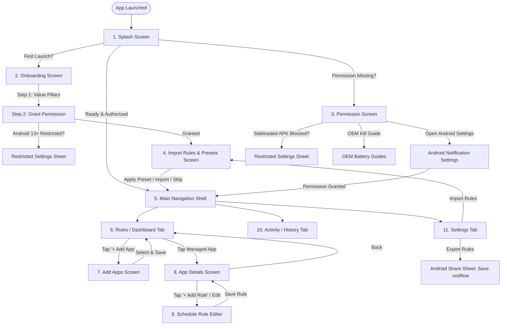

# Notiflow — App Features, Page Hierarchy & User Flow

> **Application**: Notiflow  
> **Privacy Philosophy**: 100% On-Device · Zero Telemetry · Zero Internet Permissions  
> **Platform Target**: Android (Release APK)  
> **UI Design System**: Stitch Obsidian Signal (Dark: `#09090B` / Card `#18181B` · Light: `#F9F9FB` / Card `#FFFFFF` · Signal Amber: `#F59E0B`)  
> **Design Reference**: [Google Stitch UI/UX Redesign](https://stitch.withgoogle.com/projects/14969607890769808827)

---

## 1. Executive Overview & Core Philosophy

**Notiflow** is an offline, privacy-first notification scheduler and focus manager built with Flutter. It grants users deterministic, schedule-based control over notifications from specific installed apps while leaving unmanaged apps completely untouched.

### Core Pillars
1. **Zero Telemetry & Zero Network Access**: The application completely omits the `android.permission.INTERNET` permission in `AndroidManifest.xml`. Incoming notifications are inspected in volatile local memory in microseconds and never leave the device.
2. **Deterministic Native Triage**: An on-device background service (`NotificationListenerService`) evaluates incoming notifications against user-defined rules in under 5 milliseconds.
3. **Unmanaged Apps Untouched**: Only apps explicitly chosen by the user are monitored; all other apps pass through without delay.
4. **Resilient Offline Architecture**: Operates reliably through reboots, offline/airplane mode, and without requiring any cloud account.
5. **Rules Portability & Presets**: Full support for exporting and importing `.notiflow` JSON backup files and applying curated focus presets (*Deep Work Protocol*, *Mindful Evening*, *Minimalist Default*).

---

## 2. Page Hierarchy & Total Page Count

Notiflow consists of **11 dedicated screens/pages** structured across a startup sequence, an onboarding/recovery layer, a primary 3-tab navigation shell, and contextual sub-screens, supplemented by modal sheets:

| # | Page / Screen Name | Type | Primary Role |
|---|---|---|---|
| **1** | **Splash Screen** (`SplashScreen`) | Launch Screen | Brand intro, Stitch animated icon, engine calibration, dynamic startup routing |
| **2** | **Onboarding Screen** (`OnboardingScreen`) | First-Time Flow | Value pillars explanation and initial notification permission authorization |
| **3** | **Permission & Health Center** (`PermissionScreen`) | Recovery Screen | Access restoration, OEM battery kill guides, Android 13+ sideload helper |
| **4** | **Import Rules & Presets Screen** (`ImportRulesScreen`) | Setup & Sub-Screen | Preset protocols (*Deep Work*, *Mindful Evening*, *Minimalist*), `.notiflow` file import, paste JSON |
| **5** | **Main Navigation Shell** (`MainNavigationShell`) | Container Screen | Bottom tab bar hosting Rules, Activity, and Settings |
| **6** | **Dashboard / Rules Screen** (`DashboardScreen`) | Tab 1 (Home) | Dynamic time greetings, Intercepted/Permitted metrics, overrides, managed apps list |
| **7** | **Add Apps Screen** (`AddAppsScreen`) | Sub-Screen | Device app discovery, search filtering, category chips, batch app addition |
| **8** | **App Details Screen** (`AppDetailsScreen`) | Sub-Screen | App master toggle, real-time triage simulator, quick mute pills, schedule list |
| **9** | **Schedule Rule Editor** (`ScheduleEditorScreen`) | Sub-Screen | BLOCK vs ALLOW modes, time pickers with overnight math, 7-day selector pills |
| **10** | **Activity / History Screen** (`ActivityScreen`) | Tab 2 | Chronological triage feed with filter tags, focus metrics, and audit log |
| **11** | **Settings Screen** (`SettingsScreen`) | Tab 3 | Engine health, battery guides, storage badges, export/import backups, reset |

### Key Interactive Modals
* **Android 13+ Restricted Settings Sheet (`RestrictedSettingsSheet`)**: 2-step guide modal for sideloaded APK unlocking.
* **Paste JSON Rules Modal**: In-app modal dialog to paste raw `.notiflow` JSON directly.
* **Privacy & Security Audit Sheet**: Transparent on-device audit modal demonstrating zero network egress and zero tracking.
* **Reset All Rules Confirmation Modal**: Destructive data wipe warning dialog with native cache sync.

---

## 3. End-to-End App Flow

### Flow Walkthrough
1. **Cold Start Flow**:
   - The user opens Notiflow. The **Splash Screen** animates the Stitch brand emblem, runs a 1.8s startup calibration progress bar, loads preferences, and determines where to route the user.
   - If first run: Dispatches to **Onboarding Screen**.
   - If returning user with permissions revoked (or OEM battery killed): Dispatches to **Permission Screen**.
   - If fully configured: Dispatches into the **Main Navigation Shell**.
2. **Permission & Sideloading Flow (Android 13+)**:
   - If Android restricts notification access due to sideloading (APK installation), the user taps the **Restricted Settings** guide.
   - Step 1 opens App Info (`ACTION_APPLICATION_DETAILS_SETTINGS`) $\rightarrow$ user taps `⋮` $\rightarrow$ *"Allow restricted settings"*.
   - Step 2 opens Notification Access (`ACTION_NOTIFICATION_LISTENER_SETTINGS`) $\rightarrow$ user turns Notiflow toggle ON.
   - App automatically detects permission resumption and advances to Step 3 (Rules Import) or Dashboard.
3. **Daily Management Flow**:
   - User views dynamic time greeting and triage counters on the **Dashboard (Rules)** tab.
   - User taps `+ Add App` to scan installed apps, selects target apps (e.g. WhatsApp, Slack), and adds them.
   - User taps a managed app to view the **App Details Screen** and sets up rules in the **Schedule Editor Screen** (e.g., Block 09:00 to 17:00 on weekdays).
   - Incoming notifications arriving during the scheduled window are silenced by the native engine.
   - User checks the **Activity** tab to inspect intercepted and permitted alerts.
4. **Backup & Portability Flow**:
   - User opens **Settings**, scrolls to **Rules Backup & Portability**, and taps **Export .notiflow File**.
   - The app generates a structured backup file containing all app configs and rules, opening the Android share sheet to save to Downloads, Google Drive, or messaging apps.
   - On a new device or fresh install, the user taps **Import .notiflow File** or chooses one of the curated focus presets to restore their configuration in one click.

---

## 4. Page-by-Page Contents & Detailed Feature Breakdown

---

### Page 1: Splash Screen (`SplashScreen`)

* **Purpose**: Serves as the brand intro, warms up native services, and executes intelligent route dispatching.
* **Visual & Functional Elements**:
  * **Top Brand Meta Bar**:
    - `DAEMON READY` status pill with a pulsing amber beacon.
    - App version badge (`v1.4.0`).
  * **Animated Brand Emblem (`StitchAnimatedIcon`)**:
    - **Orbital Arc Track (`orbitSpin`)**: 360° continuously rotating schedule arc with a glowing amber beacon dot.
    - **Radial Glow (`subtlePulse`)**: Ambient amber radial glow breathing behind the icon tile.
    - **Chime Bounce (`chimeBounce`)**: Micro-floating vertical elevation of the focus shield and silenced bell emblem.
    - **Entrance Pop-In (`popIn`)**: Smooth scale animation upon launch.
  * **Typography**:
    - Headline: `"Notiflow"` (26pt, bold, `#FAFAFA`).
    - Subtitle: `"Quiet focus, on your schedule"` (14.5pt, `#F59E0B`).
  * **Startup Calibration Progress Bar**:
    - Animated progress bar running over 1.8 seconds with live status labels:
      - `0% – 44%`: *"Synchronizing local schedules..."*
      - `45% – 81%`: *"Calibrating silent triggers..."*
      - `82% – 100%`: *"Quiet engine active"*
  * **Bottom Trust Capsule**:
    - Security badge: `Icons.shield_outlined` + `"100% ON-DEVICE · ZERO TELEMETRY"`.
  * **Route Dispatch Logic**:
    - Awaits `ScheduleRepository.initialize()` and `SharedPreferences`.
    - If `pref_onboarding_completed == false` $\rightarrow$ navigates to `OnboardingScreen`.
    - If `isNotificationAccessGranted() == false` $\rightarrow$ navigates to `PermissionScreen`.
    - Else $\rightarrow$ navigates to `MainNavigationShell`.

---

### Page 2: Onboarding Screen (`OnboardingScreen`)

* **Purpose**: Guides first-time users through Notiflow's value proposition and assists them in granting notification access.
* **Visual & Functional Elements**:
  * **Step 1: Sovereign Protocol (Value Pillars)**:
    - Step indicator: `STEP 1 OF 3 · COGNITIVE PEACE OF MIND`.
    - Headline: *"Silence digital noise. Preserve your focus."*.
    - Three Value Pillar Cards:
      1. **Precision Time Shields**: Silence distracting notifications during work, study, or sleep without turning off notifications device-wide.
      2. **100% Sovereign & On-Device**: Zero cloud dependencies. No internet access requested. Your notification content never leaves memory.
      3. **Unmanaged Apps Untouched**: Non-configured apps behave normally with zero interception latency.
    - Button: *"Begin Setup"* (advances to Step 2).
  * **Step 2: Notification Access Setup**:
    - Step indicator: `STEP 2 OF 3 · PERMISSION HEALTH`.
    - Headline: *"Notification Access is required"*.
    - Subtitle explaining that Android requires notification listener permission to inspect and silence incoming alerts according to rules.
    - Button: *"Open Android Settings"* (launches `Settings.ACTION_NOTIFICATION_LISTENER_SETTINGS`).
    - Helper Card: *"Having issues enabling on Android 13+?"* which launches the `RestrictedSettingsSheet`.
    - Advances to Step 3 (`ImportRulesScreen`) once permission is granted.

---

### Page 3: Permission & Health Center (`PermissionScreen`)

* **Purpose**: Dedicated recovery hub shown when notification access is revoked, missing, or blocked by the operating system.
* **Visual & Functional Elements**:
  * **Status Card**:
    - Indicator: *"Focus Shield Offline"* or *"Notification Access is paused"*.
    - Visual warning state with action guidance.
  * **3-Step Guided Reconnection Checklist**:
    1. *Open Android Settings*
    2. *Find 'Notiflow' under 'Device & app notifications'*
    3. *Toggle the Notification Access switch to ON*
  * **Direct Action Buttons**:
    - Primary Button: *"Open Android Settings"*.
    - Secondary Link: *"Sideloaded APK blocked? Unlock restricted settings"*.
  * **OEM Background Protection Guides (Collapsible Accordions)**:
    - **OnePlus / Oppo**: Disable battery optimization, enable Auto-launch.
    - **Samsung**: Add to "Never sleeping apps", set battery to Unrestricted.
    - **Xiaomi / Redmi**: Enable "Autostart", set battery saver to "No restrictions".
  * **Live Lifecycle Observer**: Automatically checks permission status when the user returns from Android Settings.

---

### Page 4: Import Rules & Presets Screen (`ImportRulesScreen`)

* **Purpose**: Allows users to import existing rules, load curated focus presets, or upload `.notiflow` backup files. Accessible as Step 3 of onboarding or directly from Settings.
* **Visual & Functional Elements**:
  * **Header**:
    - Step indicator: `STEP 3 OF 3 · RULES IMPORT` (during onboarding) or back button (from Settings).
    - Headline: *"Import Rules"*.
    - Subtitle: *"Start from a curated focus protocol, restore a backup file, or build custom schedules from scratch."*.
  * **Option 1: Upload `.notiflow` JSON File Card**:
    - Dashed card with cloud upload icon.
    - Primary Button: *"Select Backup File"*. Ingests `.notiflow` files directly.
    - Secondary Link: *"Or paste JSON directly"* opening an in-app paste modal.
  * **Option 2: Curated Focus Presets (3 Protocols)**:
    1. **Deep Work Protocol**:
       - Targets Slack, Microsoft Teams, Gmail.
       - Mode: BLOCK during 09:00 — 17:00 (Mon–Fri).
       - Badges: `SLACK: HELD`, `TEAMS: HELD`, `GMAIL: BATCH`, `09:00 — 17:00`.
       - One-tap button: *"Apply Deep Work Preset"*.
    2. **Mindful Evening**:
       - Targets Instagram, X (Twitter), YouTube.
       - Mode: BLOCK overnight from 20:00 — 08:00 (Everyday).
       - Badges: `INSTAGRAM: HELD`, `X: HELD`, `YOUTUBE: HELD`, `20:00 — 08:00`.
       - One-tap button: *"Apply Mindful Evening Preset"*.
    3. **Minimalist Default**:
       - Targets WhatsApp with 24/7 quiet focus while passing phone calls and SMS.
       - Badges: `CALLS: PASS`, `SMS: PASS`, `WHATSAPP: HELD`, `24/7 SHIELD`.
       - One-tap button: *"Apply Minimalist Preset"*.
  * **Skip / Manual Option**:
    - *"Skip & Build Manually"* button for users who prefer configuring custom rules from scratch.

---

### Page 5: Main Navigation Shell (`MainNavigationShell`)

* **Purpose**: Core application scaffold hosting the bottom navigation bar and preserving tab state across sessions.
* **Visual & Functional Elements**:
  * **Bottom Navigation Bar**:
    - **Tab 1: Rules** (`Icons.tune_rounded`) — Home dashboard with managed apps and schedules.
    - **Tab 2: Activity** (`Icons.history_rounded`) — Triage history and notification logs.
    - **Tab 3: Settings** (`Icons.settings_rounded`) — Daemon integrity, preferences, and controls.
  * **Active Tab Highlighting**: High-contrast amber illumination with smooth indicator pill animation.

---

### Page 6: Dashboard / Rules Screen (`DashboardScreen`)

* **Purpose**: Primary home screen displaying dynamic time-based greetings, triage metrics, quick temporary override pills, and managed applications.
* **Visual & Functional Elements**:
  * **Dynamic Time-Based Greeting**:
    - Evaluates the device's clock to render contextual greetings paired with matching vector icons:
      - **05:00 – 11:59**: `"Good morning"` + `Icons.wb_twilight_rounded` (Warm Amber `#F59E0B`)
      - **12:00 – 16:59**: `"Good afternoon"` + `Icons.wb_sunny_rounded` (Solar Gold `#EAB308`)
      - **17:00 – 20:59**: `"Good evening"` + `Icons.brightness_medium_rounded` (Sunset Orange `#F97316`)
      - **21:00 – 04:59**: `"Good night"` + `Icons.bedtime_rounded` (Midnight Cyan `#38BDF8`)
    - Subtitle: *"Focus Shield active · Engine running locally"*.
  * **Restoration Banner**:
    - Dismissible alert card shown upon permission recovery: *"Focus Shield Online — ACCESS RESTORED"*.
  * **Summary Metrics Grid**:
    - **Silenced Notifications Card**: Counter with `Icons.notifications_paused_rounded`.
    - **Allowed Notifications Card**: Counter with `Icons.notifications_active_rounded`.
  * **Quick Temporary Override Pills**:
    - Quick actions to temporarily override schedules without modifying rules:
      - `Mute All (15m)` / `Mute All (1h)` / `Mute All (2h)`
      - `Allow All (15m)` / `Allow All (1h)`
      - Active override pill showing remaining countdown and instant *"Restore Schedules"* button.
  * **Active Monitoring Cards (Managed Apps List)**:
    - Lists all apps currently monitored.
    - App icon, formatted name, package identifier, and current status chip (`SCHEDULED`, `MUTED`, or `ALWAYS ALLOWED`).
    - **Master Switch**: Custom toggle switch to pause/resume monitoring per app.
    - Tap card to open `AppDetailsScreen`.
  * **Floating Action Button (`+ Add App`)**: Jumps to `AddAppsScreen`.

---

### Page 7: Add Apps Screen (`AddAppsScreen`)

* **Purpose**: Scans installed applications on the device and enables users to add apps to Notiflow in batches.
* **Visual & Functional Elements**:
  * **Header**: Search bar with live substring filtering by app label or package name.
  * **Category Filter Chips**:
    - `All Apps`, `Messaging`, `Social`, `Productivity`, `System`.
  * **App Discovery List**:
    - Discovers launchable packages via native `PackageManager`.
    - Displays extracted app icons, app names, package IDs, and selection checkboxes.
    - Already-managed apps are marked with an *"Already Managed"* badge.
  * **Sticky Bottom Action Bar**:
    - Displays selected count: *"Add (X) Apps to Focus Shield"*.
    - Batch adds selected apps and returns to Dashboard.

---

### Page 8: App Details Screen (`AppDetailsScreen`)

* **Purpose**: Dedicated management hub for an individual application, displaying its rules and simulated live status.
* **Visual & Functional Elements**:
  * **App Header**:
    - Large app icon, app label, full package ID, and master monitoring switch.
  * **Live Triage Simulator Card**:
    - Real-time indicator stating whether notifications from this app are **SILENCED** or **ALLOWED** right at this minute based on current schedules and overrides.
  * **Quick Mute Pills**:
    - `15m Mute`, `30m Mute`, `1h Mute`, `Today 24h` buttons with instant override clearing.
  * **Assigned Schedule Rules List**:
    - Visual cards for all rules configured for this app.
    - Shows rule mode (`BLOCK MODE` in amber or `ALLOW MODE` in green), formatted 12h time range (`09:00 AM — 05:00 PM`), and overnight badges.
    - Quick toggle switch to activate or deactivate individual rules.
    - Delete button to remove rules.
  * **Add Rule FAB (`+ Add Schedule`)**: Navigates to `ScheduleEditorScreen`.

---

### Page 9: Schedule Rule Editor (`ScheduleEditorScreen`)

* **Purpose**: Form interface for creating and modifying time-based schedule rules.
* **Visual & Functional Elements**:
  * **Rule Name Input**: Text field to assign custom labels (e.g., *"Work Focus Hours"*, *"Sleep Shield"*).
  * **Interception Behavior (Mode Toggle)**:
    - **BLOCK Mode (Silence alerts)**: Notifications arriving in this interval are silenced.
    - **ALLOW Mode (Pass through)**: Notifications arriving in this interval pass through; silenced outside.
  * **Time Range Selector**:
    - Interactive Start Time and End Time pickers supporting 12h AM/PM and 24h formats.
    - **Overnight Interval Support**: Full support for windows crossing midnight (e.g., `20:00` to `08:00` next morning).
    - Live span calculator showing total duration (e.g., `8 hrs span`).
  * **Recurrence Days Selector**:
    - Quick preset selector chips: `Everyday`, `Weekdays`, `Weekends`.
    - 7 individual day toggle pills (`M`, `T`, `W`, `T`, `F`, `S`, `S`).
  * **Exceptions & Escalation**:
    - **Allow urgent repeated calls**: Passes priority alerts through if received twice within 3 minutes.
  * **Save Rule Action**: Validates input, saves to local storage, and syncs to the native engine.

---

### Page 10: Activity & Triage Log (`ActivityScreen`)

* **Purpose**: Chronological log of recent notifications and the actions taken by Notiflow.
* **Visual & Functional Elements**:
  * **Top Metrics Row**:
    - `Intercepted` counter, `Focus Gain` score, and `Leak Rate` percentage.
  * **Filter Bar**:
    - Segmented filter controls: `All`, `Silenced Only`, `Allowed Only`.
  * **Notification Event Stream**:
    - App icon, notification title, timestamp, and action badge (`SILENCED` in amber/coral, `ALLOWED` in green).
    - Triage reasoning tag: e.g. *"Blocked by 'Work Focus' rule"*, *"Allowed: Outside schedule"*, *"Muted by quick override"*.
  * **Header Action**: *"Clear Log"* button to wipe stored triage history.

---

### Page 11: Settings Screen (`SettingsScreen`)

* **Purpose**: Central controls for engine health, privacy metrics, rule backup/restore, triage preferences, and data reset.
* **Visual & Functional Elements**:
  * **ENGINE & BACKGROUND SERVICES**:
    - **Focus Shield Card**: Live permission status with a direct `"Manage Access"` button.
    - **Battery Optimization Card**: Battery status indicator with a guide for whitelisting Notiflow against OS killers.
  * **ON-DEVICE INTEGRITY & STORAGE**:
    - **Encrypted Local Storage Card**: Explains that all rules are stored strictly on-device, with a `24 KB` database badge aligned within card boundaries.
    - **Zero Telemetry Guarantee Card**: Highlights complete network isolation, zero analytics SDKs, and zero external tracking.
    - **Privacy Audit Action**: Top app bar button opening the complete privacy audit sheet.
  * **RULES BACKUP & PORTABILITY (.notiflow file)**:
    - **Export Rules Backup**: One-tap action to serialize all rules into a `.notiflow` JSON file and launch the Android share sheet.
    - **Import Rules Backup**: One-tap action navigating to `ImportRulesScreen` to restore from a backup file, paste JSON, or apply curated presets.
  * **TRIAGE & AUTOMATION PREFERENCES**:
    - **Silence ongoing notifications**: Toggle to filter persistent background notifications.
    - **Silence summary notifications**: Toggle to handle grouped notification bundles.
    - **Allow priority calls**: Toggle to let incoming phone calls through regardless of rules.
  * **DANGER ZONE**:
    - **Reset All Rules & Logs**: Red warning button opening a confirmation dialog. Clearing all rules resets the local database and empties the native daemon cache.
    - **Version Information**: Displays `Notiflow v1.4.0 (Build 4)`.

---

## 5. Modal Sheets & Interactive Overlays

### Restricted Settings Sheet (`RestrictedSettingsSheet`)
* **Triggered When**: Android 13+ restricts notification access for a sideloaded APK.
* **Contents**:
  * Clear explanation of Android 13+'s restricted settings security feature for non-Play Store APKs.
  * **Step 1 Button (`Open App Info`)**: Directly launches Notiflow's system App Info page via `ACTION_APPLICATION_DETAILS_SETTINGS`. Instructs the user to tap `⋮` (top-right menu) $\rightarrow$ select *"Allow restricted settings"* $\rightarrow$ authenticate with PIN/fingerprint.
  * **Step 2 Button (`Open Notification Access`)**: Directly opens Notification Access via `ACTION_NOTIFICATION_LISTENER_SETTINGS` where the toggle switch is now enabled.

---

## 6. Summary of Key App Capabilities

* [x] **11 Dedicated Screens**: Complete coverage from initial splash and onboarding to fine-grained rule editing and rules import/export.
* [x] **Dual Theme Support (Light & Dark)**: Full implementation of Stitch Obsidian Signal (`#09090B` Zinc) and Crisp Light (`#F9F9FB`) themes with high-contrast amber accent (`#F59E0B`).
* [x] **Rules Portability (.notiflow Backup)**: Full export and import workflows via local file storage, Android share sheet, and in-app JSON paste modal.
* [x] **Curated Protocols**: Pre-configured templates for *Deep Work*, *Mindful Evening*, and *Minimalist Default*.
* [x] **Dynamic Time Greetings**: Morning, afternoon, evening, and night greetings with matching colored vector icons.
* [x] **Animated Stitch Vector Icon**: 60/120 fps hardware-accelerated orbital rotation, radial aura pulse, and chime bounce.
* [x] **Overnight Interval Math**: Correctly handles overnight shifts crossing midnight (e.g. 20:00 to 08:00 next day).
* [x] **Temporary Overrides**: Quick 15m/30m/1h/2h/24h mute or allow overrides with countdown and one-tap restore.
* [x] **Android 13+ Sideloading Helper**: Built-in 2-step navigation flow to unlock restricted system settings.
* [x] **Zero Network Footprint**: Completely isolated, 100% on-device operation.
